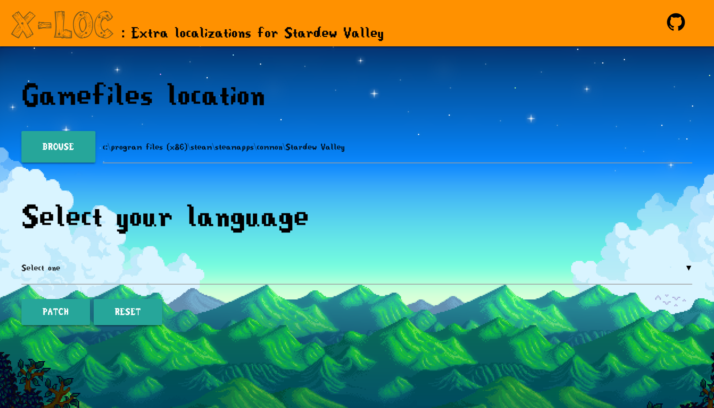

# X-loc

> Extra localizations/translations manager for Stardew Valley



#### How to use it ?

1. Download the lastest version [here](https://github.com/bguyl/x-loc/releases)
2. Launch the app
3. Patch !

As easy as one, two, three

#### I want to understand how it work

That's a good thing ! Let's do this step by step.  
Stardew Valley is developed with the Monogame framework, so all the assets (images, sounds and **texts**) will be stored in `.xnb` files.

1. It will read all `.xnb` files presents in the X-loc `./static/your_LANG/` folder.  
Theses files will replace thoses in your game folder.
2. It will rename the files that will be replaced in your game folder by adding `.xloc_bak` at the end of the name.
3. It will copy the files from X-loc to your game folder.

4. The **RESET** button will rename all the `.xloc_bak` files to their original names. This will erases translations files.

#### So, can I use it for my XNB mod ?

It need to be tested, but yes. If you try, let me know !

#### Build Setup (for programmers only)

``` bash
# install dependencies
npm install

# serve with hot reload at localhost:9080
npm run dev

# build electron application for production
npm run build

# run unit & end-to-end tests
npm test


# lint all JS/Vue component files in `src/`
npm run lint

```

---

This project was generated with [electron-vue](https://github.com/SimulatedGREG/electron-vue)@[de85f81](https://github.com/SimulatedGREG/electron-vue/tree/de85f81890c01500113738bfe57bef136f9fbf52) using [vue-cli](https://github.com/vuejs/vue-cli). Documentation about the original structure can be found [here](https://simulatedgreg.gitbooks.io/electron-vue/content/index.html).

#### Resources

Flags : [https://dribbble.com/shots/1211759-Free-195-Flat-Flags](https://dribbble.com/shots/1211759-Free-195-Flat-Flags)